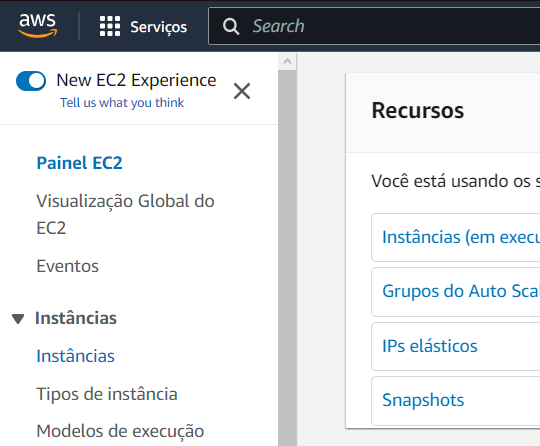
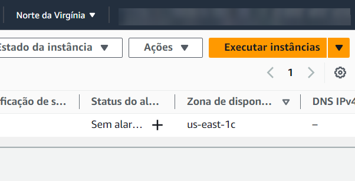
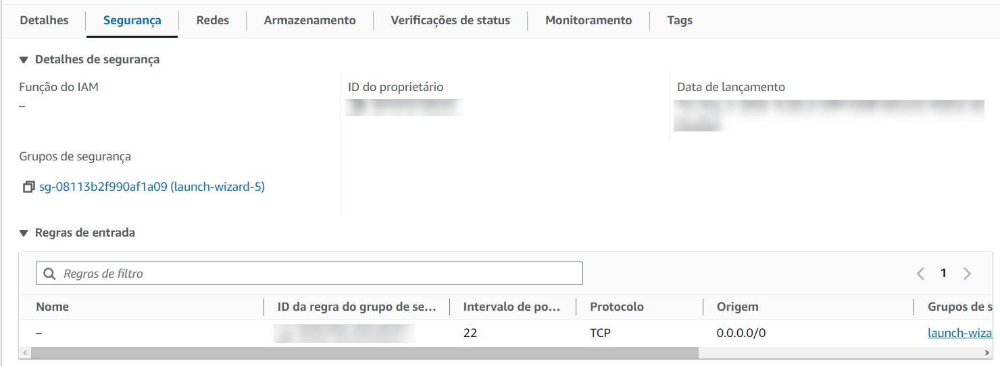
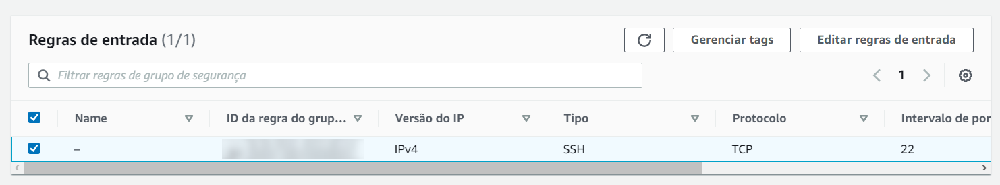
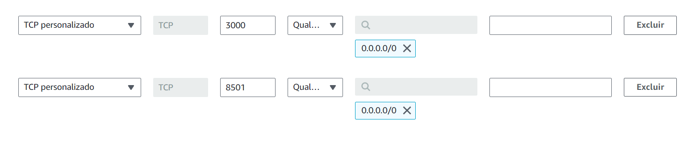
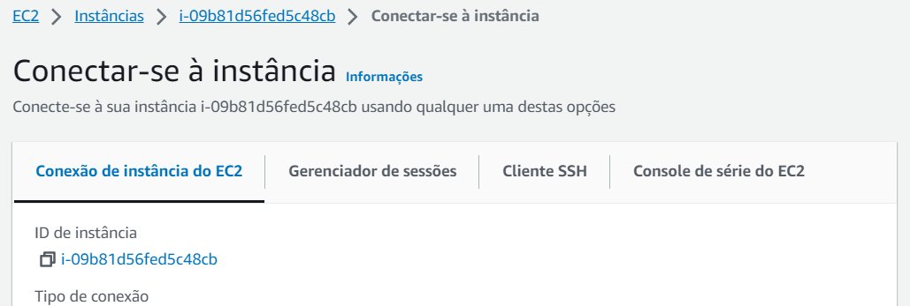
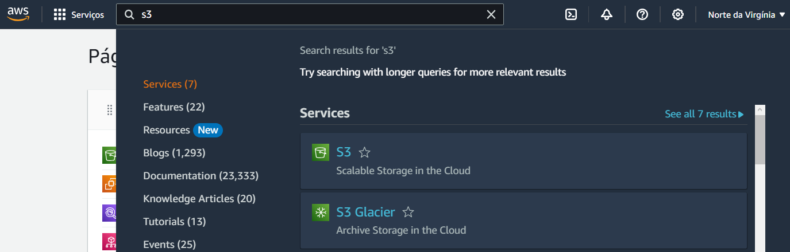
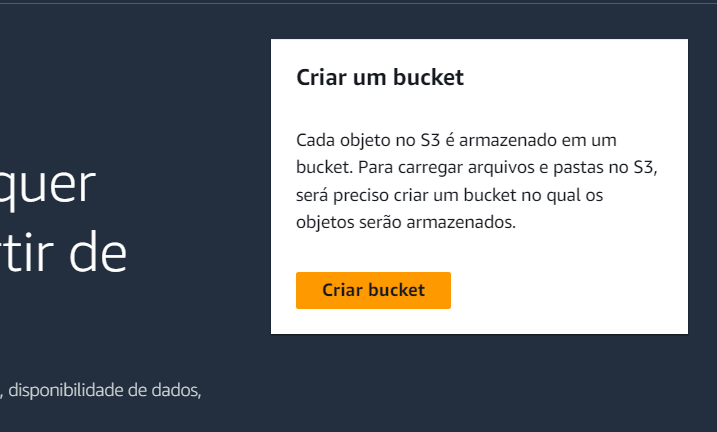
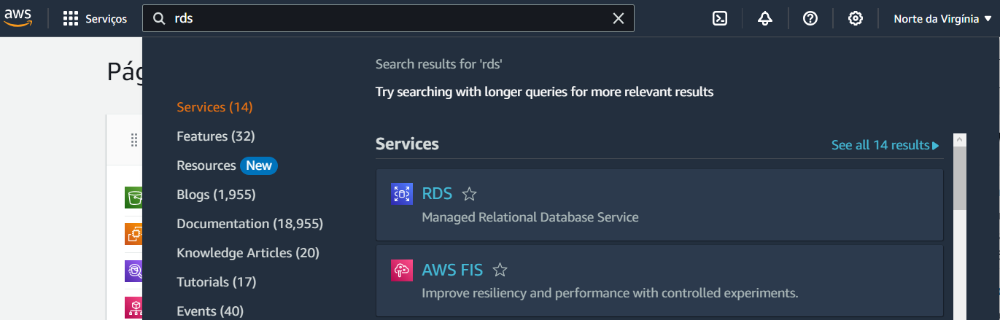
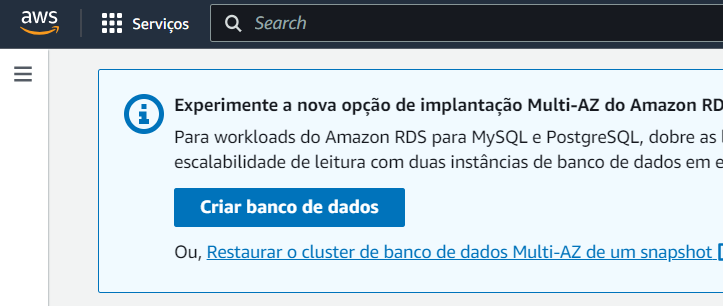

## Tabela de conteúdos
- [Tabela de conteúdos](#tabela-de-conteúdos)
- [Introdução](#introdução)
- [Requisitos mínimos](#requisitos-mínimos)
- [Localmente](#localmente)
  - [Rodando todos os componentes](#rodando-todos-os-componentes)
  - [Rodando os componentes separadamente](#rodando-os-componentes-separadamente)
- [Na Nuvem (AWS)](#na-nuvem-aws)
  - [Automaticamente](#automaticamente)
  - [Manualmente](#manualmente)

## Introdução
Este manual tem como objetivo explicar como rodar a aplicação do projeto, bem como seus requisitos mínimos e funcionalidades.
Para a execução deste projeto, consideraremos duas principais abordagens: uma implementação local, conhecida como "on-premise", e a implantação na nuvem, utilizando os serviços da AWS (Amazon Web Services). Vamos explorar ambas as opções detalhadamente neste manual, fornecendo orientações sobre como configurar e executar o sistema em ambientes locais e em nuvem.

## Requisitos mínimos
Para garantir um desempenho adequado e uma execução tranquila da aplicação do projeto em uma instância da AWS do tipo t3.small, é importante atender aos seguintes requisitos mínimos:

**Sistema Operacional:**

Ubuntu Server 22.04 LTS (ou versão mais recente) ou outra distribuição Linux suportada.
Recursos de Hardware:

Tipo de Instância: t3.medium para o frontend e t2.micro para o resto.
CPU: Pelo menos 1 vCPU.
RAM: Mínimo de 2 GB de RAM.
Armazenamento: Espaço em disco suficiente para armazenar o projeto e seus componentes.

**Software e Ferramentas:**

Docker: Deve estar instalado e configurado na instância para gerenciar a execução dos containers do projeto.
Docker Compose: Ferramenta para definir e executar aplicativos Docker multi-container.

Certifique-se de que a instância AWS está devidamente configurada com o sistema operacional adequado, e que o Docker e o Docker Compose estão instalados e funcionando corretamente. Esses requisitos são essenciais para executar os componentes da aplicação de forma eficiente na instância t3.small, garantindo uma experiência adequada de uso.

## Localmente

1. Clonar o repositório na sua máquina utilizando o comando:
```bash
git clone https://github.com/2023M7T2-Inteli/bluebird.git
```

### Rodando todos os componentes

2. Dentro da pasta do projeto, rodar:
```bash
sudo docker compose up
``` 
Nesse momento, serão lançados os serviços contidos no arquivo.

### Rodando os componentes separadamente
Pode haver a necessidade de rodar todos os componentes separadamente para questões de debug.

* Frontend:
    1. Dentro da pasta do projeto, entre na pasta frontend
    2. Já na pasta frontend, rode o comandos para gerar a imagem e lançar o container
        ```bash
        docker build -t <image-name> .
        docker run -p <port-to-be-used>:3000 --name <container-name> <image-name> 
        ```

* Backend:
Para que os gráficos carreguem corretamente dentro da aplicação frontend, é necessário lançar o streamlit. Para isso, siga as seguintes instruções:
    1. Dentro da pasta do projeto, entre na pasta backend
    2. Já na pasta backend, rode o comandos para gerar a imagem e lançar o container
        ```bash
        docker build -t <image-name> .
        docker run -p <port-to-be-used>:8501 --name <container-name> <image-name>
        ```

## Na Nuvem (AWS)

### Automaticamente
Para facilitar a implementação de toda a arquitetura, foi criado um template de stack do Cloud Formation para lançar todos os recursos necessários de modo já conectado. A fim de utilizar essa ferramenta, acesse o serviço de Cloud Formation da AWS, crie um novo stack e utilize o arquivo YAML mirai.yaml, disponível na pasta raiz desse projeto, como template. No stack, a aba de outputs mostrará todas os IPs gerados para acesso ao produto.

### Manualmente
- AWS: Bucket (S3), Tabelas Relacionais (RDS), Máquinas Virtuais (EC2).
Para rodar a aplicação em nuvem, recomenda-se a criação de uma máquina virtual no EC2, tabelas relacionais em RDS e um bucket no S3.

1. EC2\
Para lançar a instância no EC2, primeiro, deve-se fazer as configurações:
No painel do console da AWS, pesquise pelo serviço EC2.


No menu esquerdo, clique em Instâncias.\


Após isso, no canto superior direito, clique em Executar Instâncias.\


Configure e execute a instância.\
Recomendações:\
    * Nome: -\
    * Imagem: Ubuntu Server 22.04 LTS (HVM), SSD Volume Type\
    * Tipo de instância: t3.small\
    * Par de chaves: Crie um novo par de chaves\
    * Configurações de segurança: Permita tráfego HTTP & HTTPS da Internet\
    * Configurações de armazenamento: Mantenha o padrão

Volte as opções da instância criadas, procure as opções de segurança e adicione as portas dos serviços do docker compose em "Editar regras de entrada":




Volte ao menu de instâncias e clique em conectar e em seguida, escolha o método de conexão.\


Dentro da máquina virtual, configure-a para rodar os comandos necessários.
```bash
sudo apt update
sudo apt upgrade

sudo apt-get update
sudo apt-get install ca-certificates curl gnupg
sudo install -m 0755 -d /etc/apt/keyrings
curl -fsSL https://download.docker.com/linux/ubuntu/gpg | sudo gpg --dearmor -o /etc/apt/keyrings/docker.gpg
sudo chmod a+r /etc/apt/keyrings/docker.gpg

echo \
  "deb [arch="$(dpkg --print-architecture)" signed-by=/etc/apt/keyrings/docker.gpg] https://download.docker.com/linux/ubuntu \
  "$(. /etc/os-release && echo "$VERSION_CODENAME")" stable" | \
  sudo tee /etc/apt/sources.list.d/docker.list > /dev/null
sudo apt-get update

sudo apt-get install docker-ce docker-ce-cli containerd.io docker-buildx-plugin docker-compose-plugin
```

Clone o repositório do GitHub e rode o docker compose presente no diretório raiz

```bash
git clone https://github.com/2023M7T2-Inteli/bluebird.git

cd bluebird

sudo docker compose up
```

2. S3

Para o armazenamento dos arquivos .parquet sem tratamento, utilizamos o Bucket S3.\
No painel do console da AWS, pesquise pelo serviço S3.



No canto superior direito, clique em criar bucket.



Configure o Bucket e depois crie-o:\
Recomendações:\
    * Nome: -\
    * Região da AWS: Leste dos EUA (Norte da Virgínia) us-east-1
    * Propriedade de objeto: ACLs Desabilitadas\
    * Configurações de bloqueio do acesso público deste bucket: A ser definido conforme o uso\
    * Versionamento de bucket: A ser definido conforme o uso\
    * Tags - Opcional: ~\
    * Criptografia Padrão: Mantenha o padrão

3. RDS

Para salvar em tabelas relacionais, utilizamos o RDS.\
No painel do console da AWS, pesquise por RDS.



Para criar um banco de dados novo, selecione a opção:



Configure o banco:

Recomendações:\
    * Opções do mecanismo: PostgreSQL\
    * Modelos: Produção\
    * Disponibilidade e durabilidade: Cluster de banco de dados Multi-AZ\
    * Configurações: Preferências de configuração\
    * Configuração de instância: Classes padrão\
    * Armazenamento: 400GiB (min)\
    * Conectividade: Conectar-se a um recurso de computação do EC2\
    * Autenticação de banco de dados:
    * Monitoramento: Preferência de configuração\

